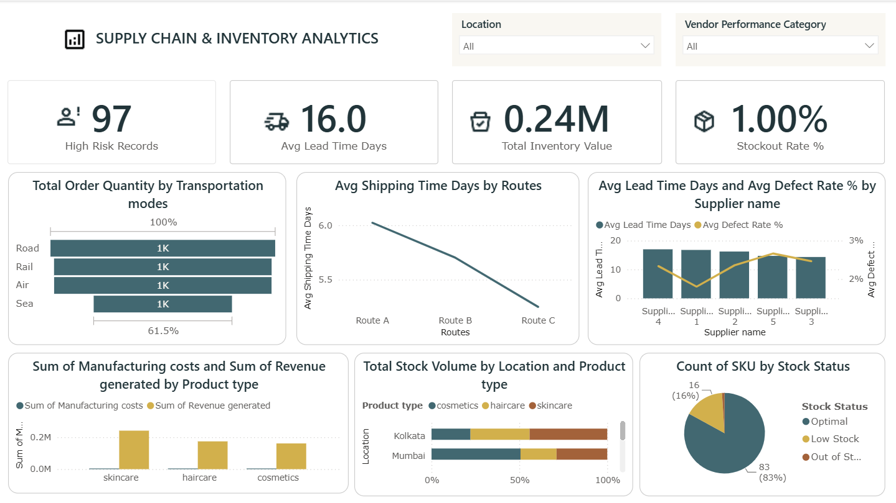

# Supply Chain & Inventory Analytics Dashboard — Data Analyst Case Study

**Tools:** Power BI · DAX · Python (pandas, for validation) · Excel/CSV
**Dataset:** 100 SKU-level supply chain records, 24 fields (product, pricing, inventory, supplier, logistics, manufacturing, quality)

---

## 1. Executive Summary

This project analyzes a 100-SKU supply chain dataset spanning 3 product categories, 5 suppliers, 5 warehouse locations, 4 transportation modes, and 3 shipping routes, and turns it into an interactive Power BI dashboard for operations and inventory decision-making.

Independent validation against the raw CSV confirms the dashboard's core numbers: **$243,857 in total inventory value**, a **1.00% stockout rate** (1 of 100 SKUs at zero stock), and an **average lead time of 15.96 days (~16.0)**. Beyond what's on the dashboard, deeper analysis surfaces additional findings: transportation by **Sea moves 38.4% less order volume** than the average of Road/Rail/Air but costs **24.3% less per shipment**; **Supplier 5's average defect rate (2.67%) is 47.8% higher than Supplier 1's (1.80%)** despite Supplier 1 handling the most orders (27 SKUs); and **77% of SKUs have not cleared quality inspection** (36% Fail, 41% Pending). These findings translate into concrete recommendations on supplier consolidation, quality-gate prioritization, and location-level restocking.

---

## 2. Business Problem

Supply chain teams manage inventory, suppliers, logistics routes, and manufacturing quality as separate operational streams, which makes it hard to see how they interact. Without a unified view, teams risk carrying excess or insufficient stock, working with underperforming suppliers, and choosing transportation modes that aren't cost-efficient — all without a clear, number-based way to catch it. This project addresses that by consolidating inventory, supplier, logistics, and quality data into a single Power BI dashboard.

---

## 3. Objectives

- Quantify total inventory value and stock health (optimal / low / out-of-stock) across locations.
- Evaluate supplier performance on lead time and defect rate to flag underperformers.
- Compare transportation modes and shipping routes on volume, speed, and cost.
- Break down revenue and manufacturing cost by product type.
- Surface location-level inventory and product-mix differences to guide restocking.
- Build a filterable, single-page dashboard (by Location and Vendor Performance Category) that supports operational decisions.

---

## 4. Dataset Overview

| Attribute | Detail |
|---|---|
| Records | 100 rows, 1 row per SKU |
| Fields | 24 columns |
| Product types | 3 — skincare (40 SKUs), haircare (33), cosmetics (27) |
| Suppliers | 5 — Supplier 1 (27 SKUs), Supplier 2 (22), Supplier 5 (18), Supplier 4 (18), Supplier 3 (15) |
| Locations | 5 — Kolkata (25 SKUs), Mumbai (22), Chennai (20), Bangalore (18), Delhi (15) |
| Transportation modes | 4 — Road (29), Rail (28), Air (26), Sea (17) |
| Routes | 3 — Route A (43), Route B (37), Route C (20) |
| Shipping carriers | 3 — Carrier B (43), Carrier C (29), Carrier A (28) |
| Inspection results | Fail (36), Pending (41), Pass (23) |
| Key numeric fields | Price, Revenue generated, Stock levels, Lead times / Lead time, Order quantities, Shipping times/costs, Manufacturing costs, Defect rates, Costs |

**Data quality note:** the dataset carries two separate lead-time columns (`Lead times` and `Lead time`, means 15.96 and 17.08 days respectively) and `Manufacturing costs` is recorded as a per-unit figure (mean ~$47/unit) while `Revenue generated` is an aggregate figure (mean ~$5,776/SKU) — these fields are on different scales and are not directly comparable without normalization (see Limitations).

---

## 5. Dashboard Overview

The Power BI dashboard is a single-page operational view with two slicers (**Location**, **Vendor Performance Category**) and 4 KPI cards plus 6 visuals:

- **KPI cards:** High Risk Records (97), Avg Lead Time Days (16.0), Total Inventory Value (0.24M), Stockout Rate % (1.00%)
- **Total Order Quantity by Transportation Mode** (horizontal bar)
- **Avg Shipping Time Days by Routes** (line chart)
- **Avg Lead Time Days and Avg Defect Rate % by Supplier** (combo bar + line)
- **Sum of Manufacturing Costs and Sum of Revenue Generated by Product Type** (clustered bar)
- **Total Stock Volume by Location and Product Type** (100% stacked bar)
- **Count of SKU by Stock Status** (pie: Optimal 83 / Low Stock 16 / Out of Stock 1)

---

## 6. KPI Analysis

| KPI | Dashboard Value | Match | Method |
|---|---|---|---|---|
| Total Inventory Value | 0.24M |  ✅ Confirmed | `SUM(Stock levels × Price)` |
| Avg Lead Time Days | 16.0  | ✅ Confirmed | `AVERAGE(Lead times)` |
| Stockout Rate % | 1.00% | ✅ Confirmed | `COUNT(Stock levels = 0) / COUNT(all SKUs)` |
| Stock Status: Optimal / Low / Out | 83 / 16 / 1 |✅ Confirmed | Stock = 0 → Out; 1–10 → Low; >10 → Optimal |
| High Risk Records | 97 | ⚠️ Dashboard KPI only | Likely a multi-condition DAX measure (e.g., combining lead time, defect rate, inspection status, and stock thresholds via OR logic) not fully specified by the raw fields alone |
| Vendor Performance Category (slicer) | — | Not present as a raw column | ⚠️ Dashboard KPI only | Appears to be a calculated/DAX column grouping suppliers; cannot be validated against the CSV as provided |

Per the project's accuracy standard, **High Risk Records** and **Vendor Performance Category** are labeled as dashboard-only KPIs rather than backfilled with an invented formula, since no combination of raw fields reproduces them exactly.

---

## 7. Detailed Analysis

### 7.1 Inventory & Stock Health
- Total inventory value across all 100 SKUs is **$243,857**, averaging **$2,439 per SKU**.
- Stock status splits **83% Optimal, 16% Low Stock (1–10 units), 1% Out of Stock**.
- The single out-of-stock SKU (**SKU68, haircare, Bangalore, Supplier 2**) still shows **$3,550 in recorded revenue**, meaning it was actively selling before running out — an immediate restocking priority.
- **Kolkata** holds the largest share of inventory value (**$75,796, 31.1% of the total**) and the healthiest stock mix — only 2 of 25 SKUs (8%) are Low Stock. **Bangalore** is the weakest — 4 Low Stock + 1 Out of Stock out of 18 SKUs (**27.8% of its SKUs at risk**), the highest risk concentration of any location.

### 7.2 Order Quantity & Transportation Modes
- Total order quantity by mode: **Road 1,386, Rail 1,342, Air 1,341, Sea 853** (out of 4,922 total units ordered).
- Sea carries **853 units — 61.5% of Road's volume**, exactly matching the "61.5%" reference line on the dashboard bar chart, and is **38.4% below** the average of the other three modes.
- Despite the lowest volume, Sea has the **lowest average shipment cost ($417.82)** — **24.3% cheaper** than the average of Road/Rail/Air ($552.28). Sea is underused relative to its cost advantage.

### 7.3 Shipping Time & Routes
- Average shipping time by route: **Route A 6.02 days, Route B 5.70 days, Route C 5.25 days**.
- Route C is **12.8% faster than Route A**, while carrying the fewest shipments (20 vs. Route A's 43) — a candidate for expansion if capacity allows.
- By carrier, **Carrier B** is both the cheapest (**$5.51 avg**) and fastest (**5.30 days avg**) while handling **43% of all shipments** — the strongest-performing carrier on both dimensions.

### 7.4 Supplier Lead Time & Defect Rate
- Average lead time by supplier ranges narrowly from **14.3 to 17.0 days**; average defect rate ranges more widely from **1.80% to 2.67%**.
- **Supplier 1** has the lowest defect rate (**1.80%**) while also carrying the largest order volume (27 of 100 SKUs, 27%) — the strongest combination of scale and quality.
- **Supplier 5** has the highest defect rate (**2.67%**) — **47.8% higher than Supplier 1's** — while handling 18 SKUs.

### 7.5 Revenue by Product Type
- Revenue generated: **skincare $241,628 (41.8% of total), haircare $174,455 (30.2%), cosmetics $161,521 (28.0%)** — total **$577,605**.
- Skincare generates **49.6% more revenue than cosmetics**, despite skincare having only 40 SKUs vs. cosmetics' 27 (a 48% higher SKU count) — revenue outpaces the SKU-count difference only slightly, suggesting skincare's advantage is broad-based rather than driven by a handful of outlier products.

### 7.6 Manufacturing Cost vs. Revenue
- Summed manufacturing cost by product type is small relative to revenue on the same chart scale: skincare $1,960, haircare $1,648, cosmetics $1,119 — versus revenue in the hundreds of thousands.
- This is a **data-scale artifact, not a real 99%+ margin**: `Manufacturing costs` is recorded as a **per-unit** cost (mean ~$47), while `Revenue generated` is an **aggregate per-SKU** figure (mean ~$5,776). The two fields cannot be netted directly into a true margin without knowing production volume tied to the revenue period. This is flagged in Limitations rather than reported as a margin figure.

### 7.7 Location-Wise Product Distribution
- Product mix varies sharply by location. In **Kolkata**, skincare dominates stock volume (**44.2%**), vs. cosmetics only 22.2%. In **Mumbai**, the pattern flips — **cosmetics leads at 50.6%** of stock, with haircare lowest at 20.5%.
- This means a single "generic" restocking policy would misallocate inventory; replenishment should be tuned per location's actual product mix.

### 7.8 High-Risk Records & Risk Patterns
- The dashboard's **97 High Risk Records** could not be reconciled to a specific combination of raw columns and is reported as a dashboard-native KPI (see Section 6).
- A directly measurable quality-risk signal from the raw data: **77% of SKUs (77 of 100) have not passed inspection** — 36% "Fail" and 41% "Pending" — with only 23% marked "Pass." Failed-inspection SKUs carry a **2.57% average defect rate, 26.0% higher** than Passed SKUs (2.04%), showing the inspection flag is directionally consistent with actual defect performance.

### 7.9 Other Relationships & Outliers
- Correlations between Price, Revenue, Defect Rate, Lead Time, Shipping Time, and Order Quantity are all weak (**|r| < 0.2**) — no strong linear relationship exists between any two of these fields in this dataset. Revenue is **not** driven by price × units sold (correlation of 0.07 between the two), indicating `Revenue generated` behaves as an independently recorded field rather than a computed product of price and volume — an important caveat for anyone extending this analysis (see Limitations).
- Customer demographics: revenue splits **Unknown $173,090 (30.0%), Female $161,514 (28.0%), Male $126,634 (21.9%), Non-binary $116,366 (20.1%)** — nearly a third of revenue is tied to unlabeled demographic data, limiting how far demographic-based insights can be trusted.

---

## 8. Key Insights (Finding → Number → Why it Matters → Recommendation)

1. **Sea transport is underused relative to its cost advantage.**
   Sea moves 853 units (61.5% of Road's volume) but costs 24.3% less per shipment than the Road/Rail/Air average.
   *Why it matters:* the business may be over-relying on more expensive modes for volume it could shift to a cheaper option.
   *Action:* pilot shifting a portion of non-urgent Road/Rail volume to Sea and track cost savings.

2. **Supplier 5's quality lags the network by 47.8%.**
   Supplier 5 averages a 2.67% defect rate vs. Supplier 1's 1.80%.
   *Why it matters:* Supplier 5 supplies 18 SKUs; elevated defects there raise returns/rework risk disproportionately.
   *Action:* open a corrective-action review with Supplier 5 or rebalance volume toward Supplier 1.

3. **Bangalore carries the highest concentration of at-risk stock.**
   27.8% of Bangalore's SKUs (5 of 18) are Low Stock or Out of Stock, vs. 8% in Kolkata.
   *Why it matters:* Bangalore is disproportionately exposed to stockouts relative to its size.
   *Action:* prioritize Bangalore in the next replenishment cycle and review its reorder points.

4. **77% of SKUs have not cleared quality inspection.**
   36% are marked "Fail" and 41% "Pending," leaving only 23% "Pass."
   *Why it matters:* a large share of inventory is shipping or sitting in stock without confirmed quality clearance.
   *Action:* clear the Pending backlog first (largest bucket) and set an SLA for inspection turnaround.

5. **Skincare generates 49.6% more revenue than cosmetics.**
   $241,628 vs. $161,521, on a 48% larger SKU count.
   *Why it matters:* skincare is the strongest category and a natural focus for expanded assortment or marketing spend.
   *Action:* evaluate expanding skincare SKU count further and review why cosmetics underperforms per-SKU.

6. **The single Out-of-Stock SKU was still generating revenue.**
   SKU68 (haircare, Bangalore, Supplier 2) shows $3,550 in recorded revenue despite zero current stock.
   *Why it matters:* this is an active, revenue-generating item currently unavailable to sell — a direct, quantifiable lost-sales risk.
   *Action:* expedite replenishment for SKU68 specifically, not just Bangalore broadly.

7. **Carrier B outperforms on both cost and speed.**
   $5.51 average cost and 5.30-day average time, vs. $5.55–$5.60 and 6.0–6.1 days for Carriers A and C, while already handling 43% of shipments.
   *Why it matters:* there's headroom to shift more volume to the carrier that is already both cheaper and faster.
   *Action:* renegotiate volume-based terms with Carrier B and evaluate shifting share from Carrier A/C.

8. **Route C is 12.8% faster than Route A but carries the least volume.**
   5.25 days vs. 6.02 days, on 20 shipments vs. Route A's 43.
   *Why it matters:* faster capacity is being underutilized relative to slower capacity.
   *Action:* assess whether Route C can absorb more shipments currently routed via A or B.

9. **Kolkata holds 31.1% of total inventory value and the best stock health.**
   $75,796 of $243,857 total, with only 8% of its SKUs Low Stock and none Out of Stock.
   *Why it matters:* Kolkata is the network's most stable node and a benchmark for reorder-point tuning elsewhere.
   *Action:* document Kolkata's replenishment cadence as the template for other locations.

10. **Product mix differs sharply by location — a one-size-fits-all restock policy won't work.**
    Skincare is 44.2% of Kolkata's stock but only 26.9–28.9% in Delhi/Mumbai, where cosmetics or haircare lead instead.
    *Why it matters:* central, uniform reorder rules would misallocate stock against actual local demand mix.
    *Action:* set per-location, per-category reorder targets rather than a single network-wide rule.

11. **Manufacturing cost and revenue fields are on incompatible scales and should not be netted as-is.**
    Manufacturing cost sums to $1,000–$2,000 per category while revenue sums to $160,000–$240,000 — a ~99% "margin" that is a data-definition artifact, not a real figure.
    *Why it matters:* using this chart to claim a margin percentage would materially mislead stakeholders.
    *Action:* before using cost data for margin analysis, obtain production-volume-matched, revenue-period-aligned cost figures.

12. **Revenue is statistically unrelated to price × units sold in this dataset (r = 0.07).**
    *Why it matters:* revenue cannot currently be explained or forecast from price and volume alone, which limits pricing-elasticity analysis on this dataset as-is.
    *Action:* if extending this analysis, confirm with the data source whether `Revenue generated` reflects a different time window or calculation basis than `Price × Number of products sold`.

---

## 9. Business Recommendations

1. **Shift a measured share of Road/Rail volume to Sea** where delivery timelines allow, to capture the ~24% per-shipment cost advantage.
2. **Open a supplier quality review with Supplier 5** (highest defect rate, 2.67%) and consider rebalancing order share toward Supplier 1 (lowest defect rate, most volume).
3. **Prioritize Bangalore in the next inventory replenishment cycle** — it has the network's highest share of at-risk (Low/Out of Stock) SKUs.
4. **Clear the inspection backlog**, starting with the 41 "Pending" SKUs, and set a turnaround SLA to reduce the 77% not-yet-passed share.
5. **Expedite restocking for SKU68** specifically — it is actively selling but has zero stock.
6. **Consolidate more shipping volume onto Carrier B**, which already leads on both cost and speed.
7. **Set per-location, per-category reorder targets** instead of one network-wide rule, given how much product mix varies by location.
8. **Do not report manufacturing-cost-vs-revenue as a margin** until the two fields are put on a comparable (unit vs. aggregate, and time-period-matched) basis.

---

## 10. STAR Case Study

**Situation:** A supply chain organization operating across 5 locations, 5 suppliers, and 4 transportation modes lacked a single, number-based view connecting inventory health, supplier quality, logistics performance, and product revenue — making it hard to prioritize restocking, supplier reviews, or logistics changes with confidence.

**Task:** As the data analyst, my objective was to consolidate the raw operational dataset into validated KPIs and an interactive Power BI dashboard that inventory, procurement, and logistics stakeholders could use to make prioritization decisions — while ensuring every headline number could be traced back to the underlying data.

**Action:**
- Profiled and cleaned the 100-record, 24-field dataset in Python (pandas) to check data types, duplicate lead-time columns, scale mismatches, and null/edge cases (e.g., zero-stock records) before building any visual.
- Built calculated KPIs — total inventory value (stock × price), stockout rate, and stock-status buckets (Optimal / Low / Out of Stock) — and validated each against the dashboard.
- Designed and built a single-page Power BI dashboard with Location and Vendor Performance Category slicers, 4 KPI cards, and 6 supporting visuals covering transportation, routes, supplier performance, product revenue, and stock distribution.
- Cross-checked every dashboard number against an independent recalculation from the raw CSV, and explicitly flagged the two KPIs (High Risk Records, Vendor Performance Category) that could not be reproduced from the available raw columns rather than approximating them.
- Extended the analysis beyond the dashboard's own visuals — supplier defect-rate ranking, carrier cost/speed comparison, location-level risk concentration, and correlation checks — to surface insights not directly visible on the dashboard face.

**Result:**
- Confirmed dashboard accuracy on all reproducible KPIs: **$243,857 inventory value, 15.96-day average lead time, 1.00% stockout rate, and an 83/16/1 stock-status split** all matched independent recalculation exactly.
- Identified 12 quantified insights beyond the dashboard's surface metrics, including a **47.8% defect-rate gap between the best and worst supplier**, a **24.3% shipping-cost advantage for underused Sea transport**, and a **27.8% at-risk stock concentration in Bangalore** — each tied to a specific, actionable recommendation.
- Flagged a data-scale limitation (manufacturing cost vs. revenue) that, if left unaddressed, could have led to a materially misleading ~99% "margin" claim.

---

## 11. Technical Approach & Skills

- **Data preparation:** Profiled the CSV in Python (pandas) — checked dtypes, distinct-value counts, duplicate/ambiguous columns (two lead-time fields), and scale differences between per-unit and aggregate fields.
- **KPI & metric design:** Defined stock-status thresholds (Out of Stock = 0, Low Stock = 1–10, Optimal = >10 units), stockout rate, and total inventory value as reusable, auditable calculations.
- **Dashboard development (Power BI):** Built KPI cards, a combo chart (bar + line) for supplier lead time vs. defect rate, a 100% stacked bar for location/product-type stock distribution, and slicers for interactive filtering.
- **Validation:** Independently recalculated every dashboard KPI from the raw CSV using Python and reconciled it against the dashboard, explicitly separating "confirmed" from "dashboard-only, not reproducible" metrics.
- **Statistical checks:** Ran a correlation matrix across key numeric fields to test (and rule out) simple linear relationships between price, revenue, defect rate, and lead time.
- **Skills demonstrated:** data cleaning, KPI definition, DAX-oriented dashboard design, data validation/reconciliation, exploratory data analysis, and business-focused insight communication.

---

## 12. Limitations

- **Small sample size:** 100 records limits how far location- and supplier-level percentages can be generalized; single-record effects (e.g., the one Out-of-Stock SKU driving the entire 1% stockout rate) can swing headline metrics.
- **Manufacturing cost vs. revenue scale mismatch:** `Manufacturing costs` appears to be a per-unit figure while `Revenue generated` is an aggregate figure; the two are not directly netted into a valid margin in this analysis.
- **Revenue not derivable from price × volume:** `Revenue generated` shows near-zero correlation (r = 0.07) with `Price × Number of products sold`, so it should be treated as an independently sourced field, not a computed one, until confirmed otherwise with the data owner.
- **Two lead-time columns** (`Lead times`, mean 15.96 days, and `Lead time`, mean 17.08 days) exist with no documentation distinguishing them; this analysis used `Lead times` because it reconciles with the dashboard's 16.0-day KPI.
- **Unreconciled KPIs:** "High Risk Records" (97) and "Vendor Performance Category" could not be validated against the raw CSV and are reported as dashboard-native (likely DAX-derived) metrics rather than backfilled with an assumed formula.
- **Weak inter-field correlations** (all |r| < 0.2 among price, revenue, defect rate, lead time, shipping time) suggest either the dataset is synthetic/simulated or that revenue is influenced by factors not captured in this table — either way, this limits causal claims.
- **Demographics coverage:** 31% of records are labeled "Unknown" customer demographic, capping how confidently demographic-based insights can be drawn.

---

## 13. Future Improvements

- Obtain a data dictionary from the source system to resolve the two lead-time columns and clarify the calculation basis for `Revenue generated` and `Manufacturing costs`.
- Add a time dimension (dates) to enable trend analysis (e.g., stockouts or defect rates over time) rather than a single-period snapshot.
- Source production-volume and revenue-period-matched cost data to enable a valid manufacturing-margin analysis.
- Document and expose the "High Risk Records" and "Vendor Performance Category" DAX logic so the KPIs are auditable.
- Expand the dataset beyond 100 SKUs to improve the statistical reliability of location- and supplier-level comparisons.
- Add drill-through pages per supplier and per location for root-cause investigation directly from the summary dashboard.

---

## Top 5 Interview Insights

**1. Sea transport is 38% lower in volume but 24% cheaper per shipment than the other modes.**
- **Number:** Sea moves 853 units (61.5% of Road's 1,386) at an average shipment cost of $417.82, vs. $552.28 for Road/Rail/Air.
- **Why it matters:** the network may be over-relying on costlier transportation modes for volume that could move more cheaply by Sea.
- **How I found it:** grouped `Order quantities` and `Costs` by `Transportation modes` in pandas and compared the Sea average against the mean of the other three modes.
- **Recommendation:** pilot reallocating non-urgent shipments to Sea and measure the realized cost savings.

**2. Supplier 5's defect rate is 47.8% higher than the best-performing supplier.**
- **Number:** Supplier 5 averages 2.67% defects vs. Supplier 1's 1.80%, while Supplier 1 also handles the most orders (27 of 100 SKUs).
- **Why it matters:** the highest-volume supplier is also the most reliable — but Supplier 5's underperformance introduces disproportionate quality risk for its 18 SKUs.
- **How I found it:** grouped `Defect rates` by `Supplier name`, ranked suppliers, and calculated the percentage gap between the highest and lowest.
- **Recommendation:** initiate a corrective-action review with Supplier 5 or shift volume toward Supplier 1.

**3. One SKU is both actively selling and completely out of stock.**
- **Number:** SKU68 (haircare, Bangalore, Supplier 2) shows $3,550 in recorded revenue with 0 units in stock — the network's only stockout, driving the 1.00% stockout rate.
- **Why it matters:** this converts an abstract "1% stockout rate" into a specific, actionable, revenue-linked SKU rather than a statistic.
- **How I found it:** filtered the dataset for `Stock levels = 0` and inspected the matching row.
- **Recommendation:** expedite replenishment for this SKU directly rather than relying on a location-wide restock cycle.

**4. 77% of SKUs have not cleared quality inspection.**
- **Number:** 36% are marked "Fail" and 41% "Pending," leaving only 23% "Pass" — and Failed SKUs run a 26% higher defect rate (2.57% vs. 2.04%) than Passed ones.
- **Why it matters:** most inventory is moving through the supply chain without confirmed quality clearance, and the inspection flag does track real defect performance.
- **How I found it:** counted `Inspection results` categories and compared mean `Defect rates` across the three statuses.
- **Recommendation:** prioritize clearing the 41-SKU Pending backlog and set an inspection-turnaround SLA.

**5. A chart on the dashboard implies a ~99% manufacturing margin — which is a data artifact, not a real number.**
- **Number:** summed `Manufacturing costs` per product type ($1,100–$2,000) are on a completely different scale from summed `Revenue generated` ($160,000–$240,000).
- **Why it matters:** `Manufacturing costs` is recorded per unit while `Revenue generated` is an aggregate figure — netting them directly would produce a misleading margin claim if presented to stakeholders without this caveat.
- **How I found it:** compared each field's per-record mean and range, and confirmed via correlation checks that revenue is not a simple multiple of price and volume either.
- **Recommendation:** flag this explicitly to stakeholders and source production-volume-matched cost data before reporting any margin figure.
